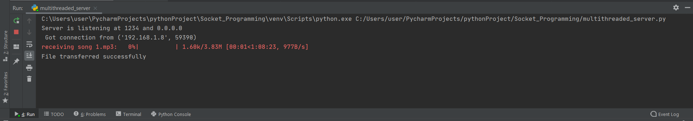
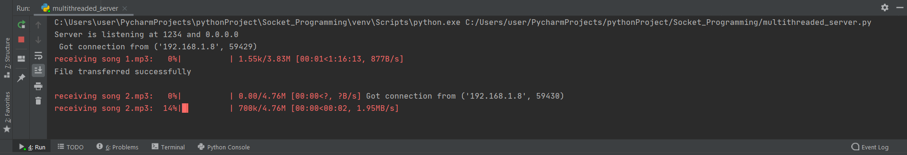
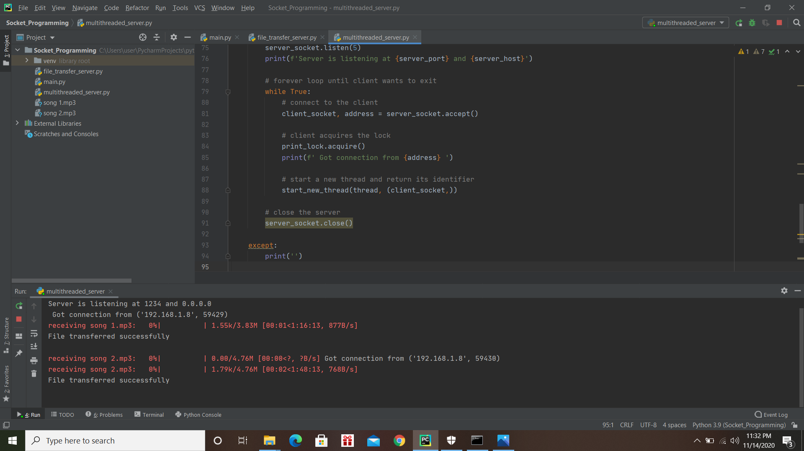
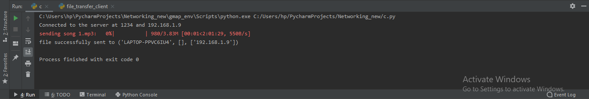

# multithreaded-socket-programming
Transfer files between two machines while displaying the transferred percentage in a progress bar

Description:
This project can transfer files between two machines when the firewall is disabled. The transferring percentage is displayed through a progress bar. However, the multithreading feature needs to be improved more.
Based on https://www.geeksforgeeks.org/socket-programming-multi-threading-python/ and https://www.thepythoncode.com/article/send-receive-files-using-sockets-python

Installation:
1. Install the requirements.txt file with 'pip install -r requirements.txt'
2. Turn off the firewall on both machines and run the `python server.py` first. 
Once the server is up, its host name will be displayed.
3. Then run `python client.py <server host name> <file location`
eg: `python client.py Laptop-15-cc1xx ./files/fileX.mp3`
4. Try for more than one client scripts to experience mutithreading

Results:
On server side
1. single client

52% completed

100% completed

2. two clients

one 100% completed and other one 14 % completed

100% completed

On client side

43% completed

100% completed

